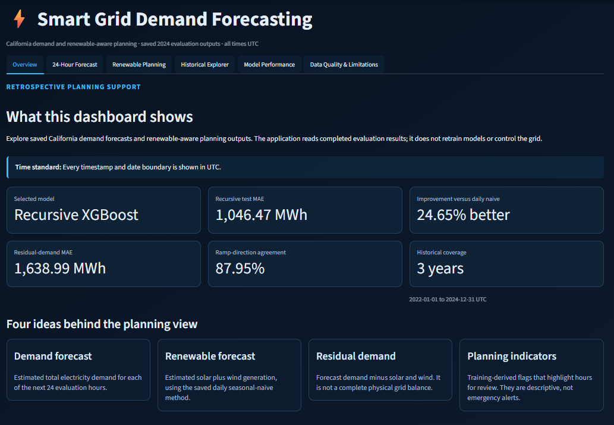
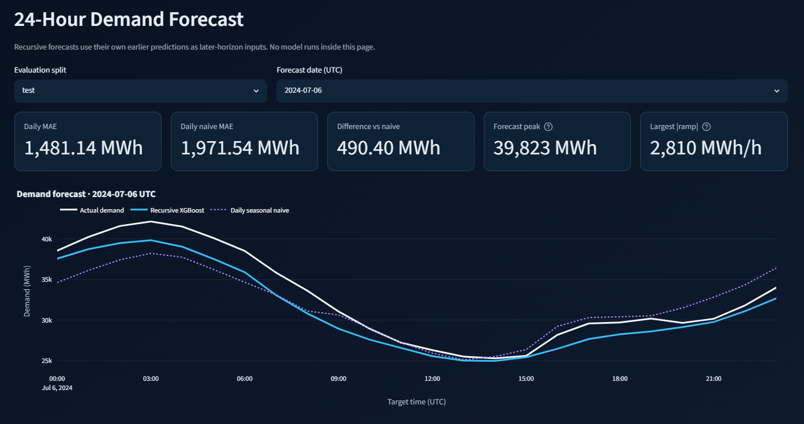
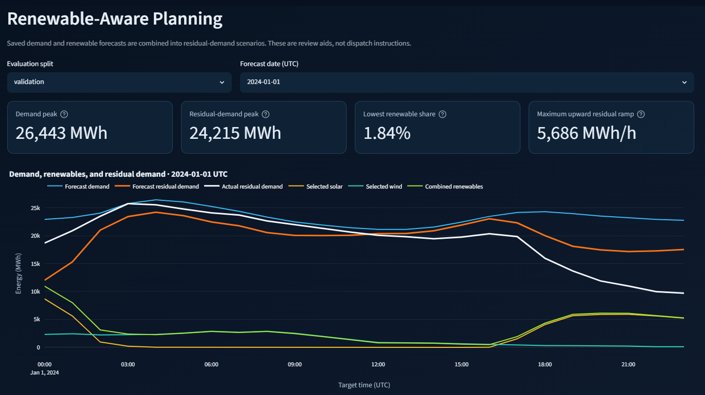
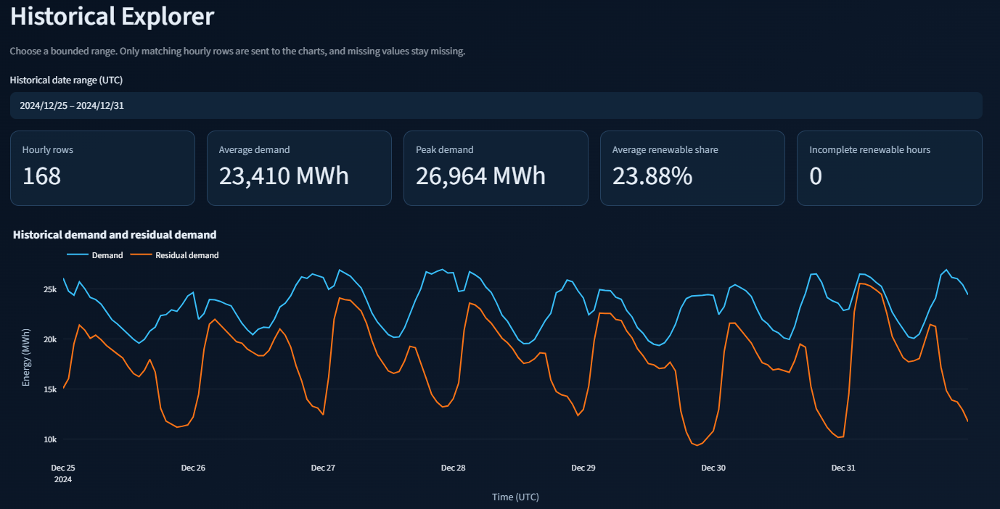
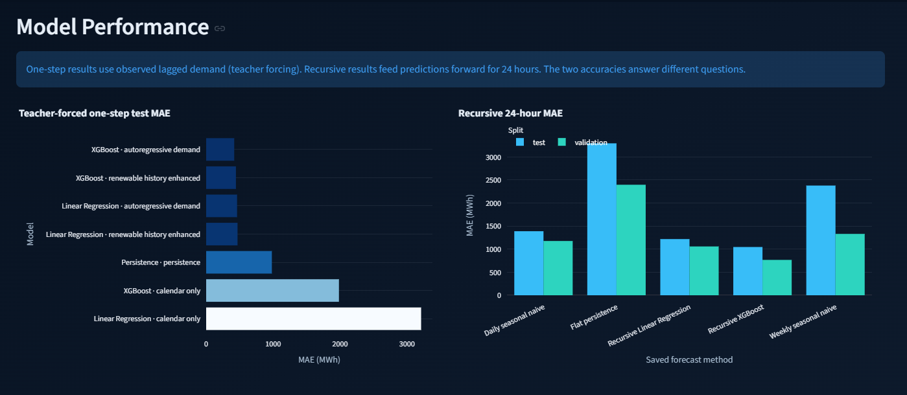
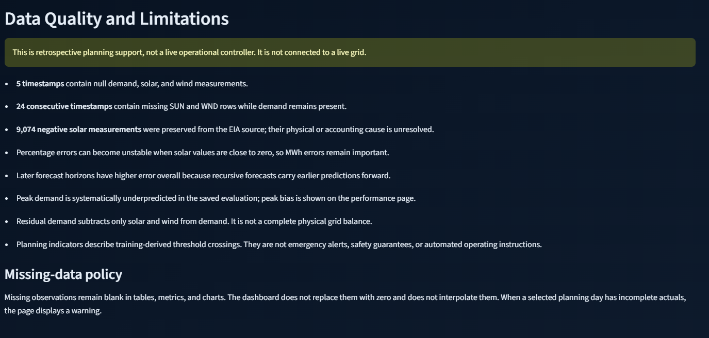

# Smart Grid Demand Forecasting and Renewable-Aware Planning

An end-to-end time-series portfolio project for California ISO (CISO) electricity demand. It uses official U.S. Energy Information Administration (EIA) hourly data, leakage-safe chronological evaluation, recursive 24-hour demand forecasts, and renewable-aware residual-demand planning. The repository includes a six-section Streamlit dashboard that runs from packaged retrospective outputs without downloading data or retraining models.

## Dashboard preview













Supporting views: [forecast error by horizon](screenshots/03_forecast_error_by_horizon.png), [residual-demand scenarios](screenshots/05_residual_demand_scenarios.png), [planning indicators](screenshots/06_planning_indicators.png), [historical renewables](screenshots/08_historical_renewables_explorer.png), [recursive horizon performance](screenshots/10_recursive_horizon_performance.png), and [peak demand with feature importance](screenshots/11_peak_demand_feature_importance.png).

## Key results

All values below are read from the saved prediction and metric tables packaged with this repository.

| Result | Test value |
|---|---:|
| Recursive XGBoost demand MAE | **1,046.47 MWh** |
| Recursive XGBoost demand RMSE | **1,449.39 MWh** |
| MAE improvement over daily seasonal naive | **24.65%** |
| Selected renewable method | **Daily seasonal naive (24-hour lag)** |
| Combined renewable MAE | **1,092.68 MWh** |
| Residual-demand MAE | **1,638.99 MWh** |
| Renewable-share MAE | **4.52 percentage points** |
| Residual-ramp direction agreement | **87.95%** |

The one-step and recursive results answer different questions. With a newly observed prior-hour demand available for every prediction, the selected one-step XGBoost model achieved 418.93 MWh test MAE on the common comparison subset. In the operationally stricter 24-hour experiment, predictions are fed back into later lag and rolling features; its test MAE is 1,046.47 MWh. The one-step score must not be presented as 24-hour performance.

## Project objectives

- Forecast the next 24 hourly CISO demand values from information available at a 23:00 UTC forecast origin.
- Establish chronological seasonal and persistence baselines before advanced models.
- Prevent future demand or renewable measurements from entering lag and rolling features.
- Combine demand forecasts with past-only solar and wind forecasts to estimate residual demand.
- Present retrospective evidence, uncertainty scenarios, thresholds, and limitations in a reproducible dashboard.

## Dataset and coverage

The source is the EIA Open Data API's hourly electric-system operating data for CISO. The processed dataset contains 26,304 continuous hourly UTC timestamps from 2022-01-01 00:00 through 2024-12-31 23:00. It includes demand, reported solar generation, reported wind generation, quality flags, combined solar/wind generation, solar/wind share, and demand after subtracting solar and wind.

The fixed chronological split is:

| Split | Inclusive UTC period | Rows |
|---|---|---:|
| Training | 2022-01-01 to 2023-12-31 | 17,520 |
| Validation | 2024-01-01 to 2024-06-30 | 4,368 |
| Test | 2024-07-01 to 2024-12-31 | 4,416 |

Rows are never randomly shuffled. Validation selects methods and configurations; test data is reserved for final reporting.

## Data-quality handling

The master timeline has no duplicate timestamps and no missing hours. Five timestamps contain null demand, solar, and wind measurements. A separate 24-hour block has demand but no returned solar or wind rows. Missing measurements remain null: the pipeline does not zero-fill or interpolate them.

The EIA source contains 9,074 negative reported solar observations and no negative wind observations in the processed period. These values are preserved and flagged rather than clipped. Analyses exclude only rows that lack the measurements required for a specific calculation, and record the affected counts.

## Methodology

Calendar features are known at prediction time. Demand lags use 1, 2, 3, 6, 12, 24, 48, and 168 hours; rolling statistics use only the 24 or 168 values strictly before the target timestamp. Renewable-history features are also lagged. No same-hour measured solar or wind value is used as a forecasting input.

Simple baselines were evaluated first: one-hour persistence, daily seasonal naive, weekly seasonal naive, and a training-only hour-of-week mean. Linear Regression and XGBoost were then compared on calendar-only, autoregressive-demand, and renewable-history-enhanced feature groups. Missing predictors and targets were not imputed.

## Forecasting models

The selected one-step model was XGBoost with autoregressive demand features, chosen by validation MAE. On the common test subset it achieved 418.93 MWh MAE and 576.39 MWh RMSE, compared with 981.51 MWh MAE for one-step persistence on the same rows.

Linear Regression provides an interpretable comparison, while XGBoost captures nonlinear relationships. Feature importance is predictive rather than causal; correlated lag and rolling features also make coefficient magnitudes unsuitable for causal interpretation.

## Recursive 24-hour evaluation

One forecast is issued at 23:00 UTC for the following UTC day. At horizon 1, features use observed history through the origin. Each XGBoost prediction is then added to an origin-specific buffer so later lags and rolling windows use earlier predictions wherever actual future demand would be unavailable. Evaluation uses daily rolling origins, with observed history refreshed at each new origin.

Recursive XGBoost was selected on validation and achieved 1,046.47 MWh test MAE and 1,449.39 MWh RMSE across 184 complete test days. The daily seasonal-naive 24-hour benchmark achieved 1,388.90 MWh MAE, so recursive XGBoost improved MAE by 24.65%. Its top-decile-demand test MAE was 1,344.10 MWh; peak hours were underpredicted on average, which remains an important operational limitation.

## Renewable-aware planning

Daily seasonal naive was selected using validation combined-renewable MAE only. On the test split, combined solar/wind MAE was 1,092.68 MWh. Combining that forecast with recursive demand produced residual-demand MAE of 1,638.99 MWh and renewable-share MAE of 4.52 percentage points. Forecast and actual residual-ramp directions agreed on 87.95% of complete within-forecast comparisons.

Conservative, typical, and favourable renewable cases use past-only same-UTC-hour 25th, 50th, and 75th percentiles. They are empirical planning scenarios, not calibrated prediction intervals. High-demand, high-residual-demand, upward-ramp, and low-renewable-share indicators use thresholds fitted only on training observations. They support human review and are not dispatch or safety instructions.

## Streamlit dashboard

The dashboard contains six sections:

1. Overview
2. 24-Hour Forecast
3. Renewable Planning
4. Historical Explorer
5. Model Performance
6. Data Quality and Limitations

It reads 12 explicitly tracked CSV assets: the processed historical table plus selected recursive, planning, one-step metric, and feature-importance tables. It does not fit models, call an API, impute values, or modify analytical outputs. Validation and test forecast dates are selectable, and forecast/planning tables can be downloaded with explicit UTC timestamps.

## Repository structure

```text
smart-grid-demand-forecasting/
├── data/
│   ├── processed/                 # Tracked dashboard history; other generated CSVs ignored
│   ├── raw/                       # Ignored EIA API responses
│   └── *.md                       # Source, quality, split, and methodology policies
├── models/                        # Generated fitted artifacts (ignored; not needed by dashboard)
├── notebooks/                     # Six completed analytical notebooks
├── results/
│   ├── models/tables/             # Three tracked dashboard tables
│   ├── planning/tables/           # Five tracked dashboard tables
│   └── recursive/tables/          # Three tracked dashboard tables
├── screenshots/                   # Twelve tracked final dashboard PNGs
├── src/                           # Pipeline, validators, and dashboard data layer
├── tests/                         # Dashboard data-layer unit tests
├── streamlit_app.py               # Six-section Streamlit application
└── requirements.txt
```

Generated model binaries are deliberately not packaged: the dashboard uses saved predictions and metrics and never loads an estimator. The full reproduction pipeline recreates model artifacts before recursive inference.

## Installation and local setup

From Windows PowerShell with Python 3.13 installed:

```powershell
git clone https://github.com/mhafna/smart-grid-demand-forecasting.git
cd smart-grid-demand-forecasting
py -3.13 -m venv .venv
.\.venv\Scripts\python.exe -m pip install -r requirements.txt
```

No API key or raw data download is needed to view the packaged dashboard.

## Running the dashboard

```powershell
.\.venv\Scripts\python.exe -m streamlit run streamlit_app.py
```

The app reads saved retrospective outputs. Starting it does not retrain a model, rerun inference, or contact EIA.

## Reproducing the pipeline

Full reproduction is optional and more expensive than viewing the dashboard. It requires an EIA API key in the `EIA_API_KEY` environment variable. Raw API responses, generated feature tables, most analytical outputs, and model binaries are intentionally ignored.

Run the completed scripts in this order:

```powershell
# 1. Fetch and validate EIA data
.\.venv\Scripts\python.exe src\fetch_eia_history.py 2022-01-01 2024-12-31
.\.venv\Scripts\python.exe src\validate_eia_history.py 2022-01-01 2024-12-31

# 2. Build the processed dataset
.\.venv\Scripts\python.exe src\build_historical_dataset.py

# 3. Run exploratory analysis
.\.venv\Scripts\python.exe src\run_eda.py

# 4. Diagnose source data-quality issues
.\.venv\Scripts\python.exe src\diagnose_negative_generation.py

# 5. Build and validate leakage-safe features
.\.venv\Scripts\python.exe src\build_features.py
.\.venv\Scripts\python.exe src\validate_features.py

# 6. Run and validate chronological baselines
.\.venv\Scripts\python.exe src\run_baselines.py
.\.venv\Scripts\python.exe src\validate_baselines.py

# 7. Train and validate one-step models
.\.venv\Scripts\python.exe src\train_one_step_models.py
.\.venv\Scripts\python.exe src\validate_one_step_models.py

# 8. Run and validate recursive 24-hour forecasts
.\.venv\Scripts\python.exe src\run_recursive_forecasts.py
.\.venv\Scripts\python.exe src\validate_recursive_forecasts.py

# 9. Create and validate renewable-planning outputs
.\.venv\Scripts\python.exe src\run_renewable_planning.py
.\.venv\Scripts\python.exe src\validate_renewable_planning.py

# 10. Launch the dashboard
.\.venv\Scripts\python.exe -m streamlit run streamlit_app.py
```

## Tests and validation

The repository provides an offline dashboard validator and standard-library unit tests:

```powershell
.\.venv\Scripts\python.exe src\validate_dashboard.py
.\.venv\Scripts\python.exe -m unittest discover -s tests -v
```

The dashboard validator checks all 12 source schemas, UTC ordering, complete horizons 1-24, forecast/planning alignment, headline metric reproduction, renewable formulas, training-derived indicators, missing-value preservation, downloads, static read-only safety, and source hashes. The stage-specific validators shown in the reproduction sequence independently test features, baselines, one-step models, recursive forecasts, and planning outputs.

## Limitations

- This is a retrospective CISO study using 2022-2024 UTC data, not a live forecasting service.
- The model has no weather, outage, market, interchange, storage, or holiday inputs.
- Residual demand subtracts only reported solar and wind; it is not complete physical grid balance.
- Reported negative solar values and documented data gaps are preserved and can affect renewable metrics.
- Recursive errors can compound, and peak demand is underpredicted on average.
- Empirical renewable scenarios are not calibrated uncertainty intervals.
- Planning indicators are not operating commands, safety guarantees, price forecasts, or savings estimates.

## Future improvements

- Add genuinely forecast-available weather variables and evaluate their incremental value without leakage.
- Add explicit holiday and exceptional-event features.
- Evaluate calibrated probabilistic forecasts and interval coverage.
- Test additional years and grid regions for temporal and geographic robustness.
- Add drift monitoring and scheduled data refreshes before any live deployment.

## Author

Created by [Maryam Hafna](https://github.com/mhafna).

Data source: U.S. Energy Information Administration, Hourly Electric Grid Monitor / electric-system operating data for California ISO.
